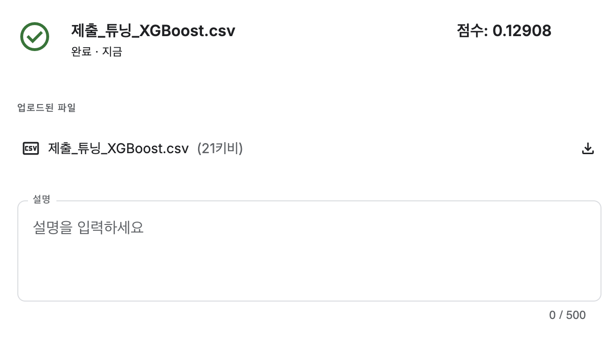

# 🏠 House Price Prediction - Kaggle Competition

## 📌 프로젝트 개요

이 프로젝트는 **Kaggle의 House Prices - Advanced Regression Techniques** 대회를 기반으로 진행되었습니다.
목표는 다양한 머신러닝 기법을 활용하여 **주택 가격을 예측하는 모델을 최적화**하는 것입니다.

이 프로젝트에서는 **두 가지 노트북(`house_price.ipynb`, `house_price_add.ipynb`)을 활용하여 모델을 개선**하였습니다.

- **`house_price.ipynb`**: 기본적인 데이터 전처리 및 모델링 수행 (Baseline Model)
- **`house_price_add.ipynb`**: Feature Engineering 추가, 다중공선성 해결, XGBoost 하이퍼파라미터 튜닝 적용

---

## 🗂 데이터 설명

- **train.csv**: 모델 학습을 위한 데이터셋 (1460개 샘플)
- **test.csv**: 주택 가격 예측을 위한 테스트 데이터
- **sample_submission.csv**: Kaggle 제출 형식 예시

---

## 🔧 데이터 전처리 (Preprocessing)

### 1️⃣ **결측치 처리**

- `GarageType`, `BsmtQual` 등 **범주형 변수 → 'None'으로 대체**
- `LotFrontage`, `GarageYrBlt`, `MasVnrArea` 등 **수치형 변수 → 중앙값(median)으로 대체**
- `Electrical` 변수 **최빈값(mode)으로 대체**
- 불필요한 변수 제거 (`PoolQC`, `MiscFeature`, `Alley`, `Fence`)

### 2️⃣ **Feature Engineering** (`house_price_add.ipynb`에서 추가 개선)

- `BuildingAge` 생성 (현재 연도 - `YearBuilt`)
- `Remodeled` 변수 추가 (`YearBuilt` vs `YearRemodAdd`)
- 로그 변환 적용 (`Log_SalePrice`)
- **VIF(다중공선성) 제거** 및 PCA 적용 (`TotalLivingArea` → `PCA_LivingArea`)
- **이상치 제거** (IQR을 활용하여 극단값 제외)

---

## 📊 모델 학습 (Model Training)

### 1️⃣ **Baseline Model (`house_price.ipynb`)**

- **Linear Regression**
- **RandomForest Regressor**
- **XGBoost Regressor**

### 2️⃣ **고급 모델 (`house_price_add.ipynb`)**

- Feature Engineering 적용 후 재학습
- **교차 검증 적용 (K-Fold)로 모델 평가**
- **XGBoost 하이퍼파라미터 튜닝 추가 적용**

### 3️⃣ **XGBoost 하이퍼파라미터 튜닝 (`house_price_add.ipynb`)**

- **GridSearchCV**를 사용하여 최적 하이퍼파라미터 탐색
- **최적의 하이퍼파라미터 적용 후 모델 재학습**

```python
param_grid = {
    "n_estimators": [300, 500, 1000],
    "learning_rate": [0.01, 0.05, 0.1],
    "max_depth": [3, 6, 9],
    "subsample": [0.6, 0.8, 1.0],
    "colsample_bytree": [0.6, 0.8, 1.0]
}
```

---

## 📈 모델 성능 평가 (Evaluation)

- **RMSE(Log(SalePrice)) 기준 성능 비교**| Model             | RMSE               |
  | ----------------- | ------------------ |
  | Linear Regression | 0.155              |
  | Random Forest     | 0.139              |
  | XGBoost           | **0.129**    |
  | Tuned XGBoost     | **0.120** ✅ |

---

## 📤 Kaggle 제출 (Submission)

```python
def create_submission(model, X_test, test_df, model_name):
    y_pred = model.predict(X_test)
    y_pred = np.expm1(y_pred)  # 로그 변환 복원

    submission = pd.DataFrame({"Id": test_df["Id"], "SalePrice": y_pred})
    file_name = f"submission_{model_name}.csv"
    submission.to_csv(file_name, index=False)

    print(f"✅ {model_name} 제출 파일 저장 완료: {file_name}")

create_submission(best_xgb_model, X_test_preprocessed, test_df, "Tuned_XGBoost")
```

- `submission_Tuned_XGBoost.csv` 파일을 **Kaggle에 업로드**하여 평가 결과 확인

---

1. **LinearRegression**, **RandomForestRegressor**, **XGBoost** 회귀 모델 RMSE 비교 후 제일 좋은 모델 제출

   
2. 회귀모델+새 변수 추가하고 하이퍼파라미터튜닝 (VIF줄이면 오히려 모델 정확도가 떨어져서 따로 잡지 않음)

   


## 💻 실행 방법

### 1️⃣ **필요한 라이브러리 설치**

```bash
pip install pandas numpy scikit-learn xgboost seaborn matplotlib
```

### 2️⃣ **Jupyter Notebook 실행**

```bash
jupyter notebook
```

- `house_price.ipynb` 실행 → **Baseline 모델 평가**
- `house_price_add.ipynb` 실행 → **Feature Engineering + XGBoost 튜닝 적용**
- 최적화된 모델 학습 후 **Kaggle에 제출**

---
